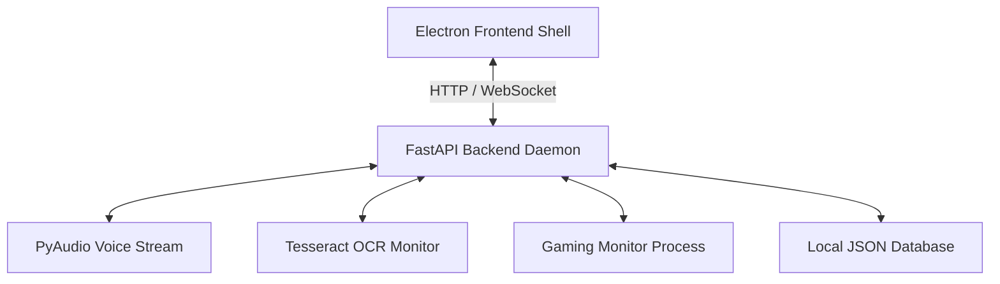

# VESPERA OS Architecture Design

VESPERA OS features a highly decoupled, multi-process architecture to maximize system performance and UI responsiveness.

## Components Map

### 1. Electron Frontend
* Tech Stack: React, Vite, Framer Motion, HSL particles canvas.
* Role: Render the dark-glassmorphism dashboard, display active stats, system metrics, and cognitive memory graphs.

### 2. Python Backend Core
* Tech Stack: Python 3.12, PyAudio, fastapi, uvicorn.
* Role: Drives wake-word listening, handles Tesseract OCR queries, manages the local database (`memory.json`), and updates processes dynamically.
