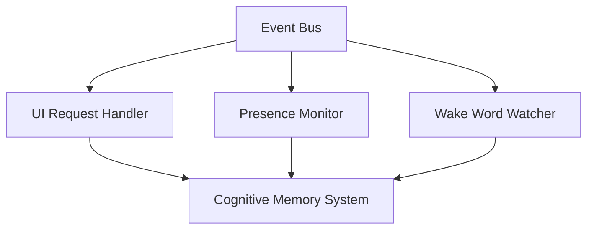

# Cognitive Architecture

VESPERA OS operates as a sentient desktop agent, relying on a main execution loop, localized thread boundaries, and a dynamic event bus.

## Subsystem Details

### 1. Main Cognitive Loop
- The main thread coordinates asynchronous tasks (UI HTTP server, background file watchers, audio status loops).
- Runs an event dispatcher loop that processes events from the event bus queue.

### 2. Presence Monitor
- Tracks user presence using local telemetry signals (input activity, window state, system uptime, and camera/mic activity).
- Publishes presence status modifications to the orb UI dynamically.

### 3. Safety and Concurrency
- Uses explicit mutex locking (`threading.Lock()`) across shared statuses in `ui_server.py`.
- Thread pools execute blocking shell requests (like running processes or launching applications).
