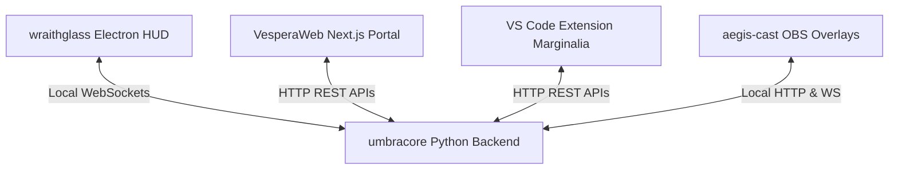

# 🌌 VESPERA OS — Sentient Cognitive Operating System Layer

Vespera OS is a local-first desktop integration framework that unites custom hardware telemetry, streaming automation, IDE capabilities, and artificial intelligence into a unified desktop assistant.

---

## 🏛️ System Architecture: The 5 Pillars

Vespera is structured as an ecosystem consisting of five distinct components that communicate securely via local network sockets:

### 1. 🧠 umbracore (Python Backend)
The core daemon process and cognitive driver.
* **Telemetry Monitoring**: Continuously tracks CPU, RAM, and GPU status via `psutil`.
* **The Chauffeur**: Auto-connects to OBS WebSockets to automatically transition streaming scenes on action cues.
* **The Morning Briefing**: Synthesizes and narrates system health, weather reports, and planner items on startup.
* **The Silent Butler**: Automates target file organization (e.g., sorting downloads).

### 2. 🌐 VesperaWeb (Next.js Command Center)
A responsive web interface hosting real-time telemetry and management tools:
* **System Metrics**: Dynamically maps live CPU and RAM meters.
* **Device Control**: Toggles microphones, enables Screen/Vision monitoring, interrupts AI synthesis, and initiates core shutdowns.
* **Install Engine**: Contains integrated install script setups for `WinGet`, `Scoop`, and `Chocolatey`.

### 3. 🎨 wraithglass (Electron Frontend)
The offline-first desktop HUD:
* **Liquid SVG Visualizer**: Renders a GPU-accelerated fluid visualizer orb representing active cognitive states (Listening, Thinking, Speaking).
* **System Dashboard**: Houses profile settings, local files, and memory maps.

### 4. ✍️ VS Code Extension (Marginalia)
An inline code telepathy extension:
* Streams real-time AI suggestions directly into active documents when hovering over symbols or requesting adjustments.

### 5. 📺 aegis-cast (OBS Overlays)
Vite-powered broadcast widgets that hook into OBS as browser sources, reacting dynamically to system states.

---

## 🛡️ Core Philosophy

* **Local-First & Private**: Telemetry and profile data are saved exclusively within `%APPDATA%\nebula`. There are no external cloud pipelines tracking your documents or credentials.
* **Umbracore Mode**: Automatically sets visual opacities to `0%` if screen sharing apps (e.g., Discord, OBS) attempt to capture the canvas layout.
