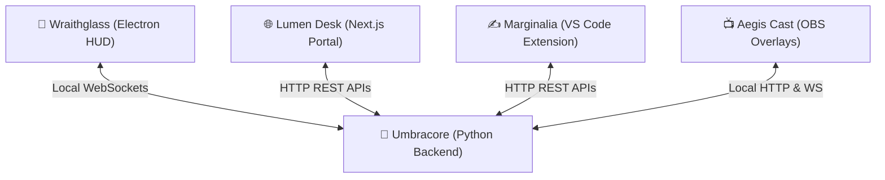
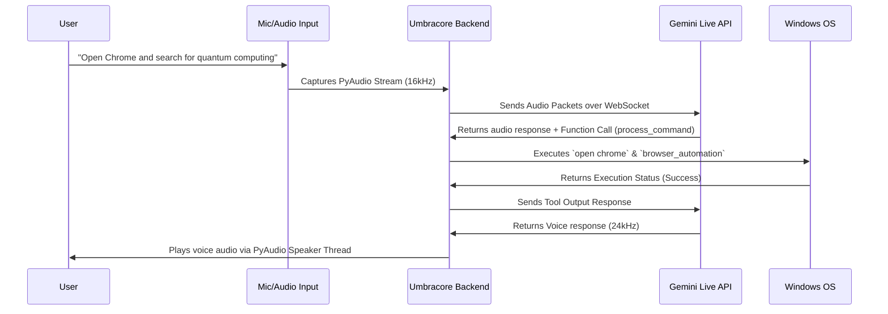

# 🌌 VESPERA OS — Architecture & Capabilities Explainer

Vespera OS is a local-first, sentient cognitive operating system layer and desktop assistant. It bridges the gap between natural language reasoning and raw OS-level automation by fusing the **Gemini 3.1 Live API**, custom system hooks, screen-space vision, and a dynamic self-learning engine.

---

## 🏛️ System Architecture: The 5 Pillars

Vespera is designed as a modular monorepo consisting of 5 main modules:

1.  **`umbracore` (Python Backend)**: The brain and cognitive supervisor. Runs the Live AI session, system monitoring, OCR, file indexers, and local socket server.
2.  **`lumen-desk` (Next.js Web Portal)**: A premium web dashboard for real-time monitoring, settings adjustments, system telemetry mapping, and local command execution.
3.  **`wraithglass` (Electron HUD)**: A desktop HUD hosting a GPU-accelerated liquid SVG orb that visualizes Vespera's active cognitive states (`listening`, `thinking`, `speaking`, `tool`).
4.  **`marginalia` (VS Code Extension)**: Inline AI suggestions and code telepathy streaming directly into active files.
5.  **`aegis-cast` (Vite OBS Overlays)**: Real-time broadcast widgets used as OBS browser sources, animating in response to assistant states.

---

## 🧠 How the AI Engine Works (The Cognitive Loop)

At its core, Vespera operates on a low-latency, real-time voice and tool execution loop driven by **Gemini 3.1 Live Preview** over WebSockets.

---

## 🛠️ How Vespera "Does Everything"

Vespera achieves full-system control and intelligence using targeted Python libraries and system APIs:

### 1. Natively Controlling the Host OS
Vespera maps conversational requests into OS-level instructions via python libraries:
*   **Window Arrangement**: Snaps, minimizes, maximizes, and arranges open windows using `pywin32` and raw Windows handle manipulation.
*   **System Controls**: Manipulates system volume, screen brightness, and power states (e.g., locking the PC) directly.
*   **Application Launcher**: Resolves short queries (like "chrome" or "notepad") into exact executable paths using a local fuzzy-matching registry indexer, then launches them silently.

### 2. OCR-Driven Screen Space Vision
Vespera can "see" what is on your screen:
*   Calling `read_screen_text` captures a high-resolution screenshot of your main display.
*   The screenshot is processed using an OCR engine (such as Tesseract or built-in Windows OCR APIs) to extract all text elements.
*   Vespera maps these OCR coordinates, allowing it to execute the `click_text` action—clicking exactly on any word or button on your screen with 100% precision.

### 3. The Cognitive Memory Engine
Vespera maintains a persistent memory system stored locally in JSON databases under `%APPDATA%\Vespera\data\`:
*   **Permanent Profile**: Personal facts and user details (interests, favorite colors, habits).
*   **Long-Term Memories**: High-context details recorded from previous chat sessions.
*   **User Goals**: Active objectives the user wants Vespera to support proactively.
*   **Saved Workflows**: Mapped custom operations that Vespera learns.
*   On every WebSocket startup, these memory collections are compiled and injected directly into Gemini's **System Instructions**, giving Vespera native, persistent memory across restarts.

### 4. Meta-Programming & Dynamic Skill Learning
One of Vespera's most powerful capabilities is its ability to write its own code and learn new features:
1.  **Request**: The user asks Vespera to learn a new skill (e.g., *"Learn how to convert files from PNG to PDF"*).
2.  **Coding**: Vespera writes the Python function to do this.
3.  **Sandbox Testing**: Vespera runs `test_python_code` in a isolated background subprocess. This runs the generated script, checks for compilation/runtime errors, and returns stdout/stderr.
4.  **Saving**: If the code executes successfully with no errors, Vespera invokes `save_tested_skill`. This appends the code to `custom_skills.py` and saves the trigger phrase in `skills_knowledge.json`.
5.  **Execution**: The new function is dynamically imported and reloaded into memory using `importlib.reload()`, making it instantly ready to run via `execute_skill()`.

---

## 🛡️ Core Philosophy: Privacy-First & Local Security
*   **Local Data Boundary**: All system state, settings, logs, and database files reside strictly on your local machine.
*   **Screen-Capture Shield**: When active, the Wraithglass HUD automatically drops its opacity to `0%` if any capture or streaming application (such as Discord or OBS) attempts to record its layout, keeping your AI assistant's interactions private.
