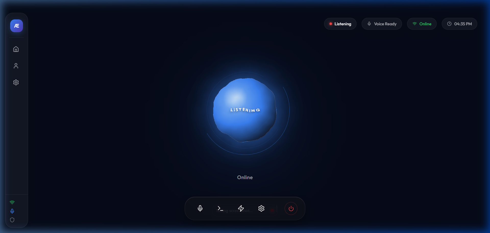
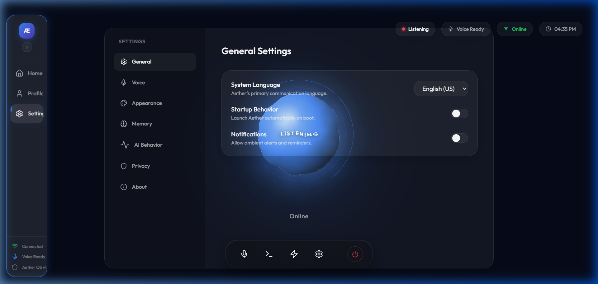

# 🌌 ADITYA 

<div align="center">
  
  <p><em>Profoundly intelligent. Unapologetically elegant. The pinnacle of bespoke cognitive architecture.</em></p>

  [](#)
  [](#)
  [](#)
  [](LICENSE)
</div>

---

## 💎 The Starlight Philosophy

ADITYA is not merely software; it is a meticulously crafted extension of your volition. Designed with the uncompromising precision of Cupertino and the whisper-quiet luxury of Goodwood, it anticipates your needs before they materialize. 

Where others see pixels, we see a vast canvas of obsidian glass and aerospace-grade intelligence. Welcome to the absolute apex of digital luxury.

### Uncompromising Aesthetics
* **Obsidian Glassmorphism:** Our interface is forged from virtual brushed titanium and deep, translucent glass. It does not simply display information; it breathes. 
* **The Phantom Orb:** An interactive, fluid-dynamics visualizer that responds to your voice with the grace of a grand piano. It shifts hues elegantly—sapphire for listening, amethyst for cognition, and emerald for execution.
* **Starlight Particle Canvas:** A GPU-accelerated backdrop that gently drifts across your display, reminiscent of a handcrafted starlight headliner. It is there when you need it, and completely invisible when you don’t.

---

## 🖼️ The Bespoke Gallery

A glimpse into the ADITYA experience, rendered natively in our ultra-optimized Electron shell.

### 🏠 The Grand Dashboard
Your central command. Effortless telemetry, curated insights, and total control—presented with museum-grade typography.


### ⚙️ The Couture Configuration
Tailor your experience. Adjust your persona, refine the acoustics, and shape the intelligence to your exact specifications.


---

## 🛠️ The Architecture of Silence

Beneath the elegant exterior lies a dual-engine architecture capable of staggering performance, executing millions of operations per second in absolute silence.

* **The Vision Layer (React Pro + Vite):** A front-end architecture so fluid it feels inevitable. Built on advanced Framer Motion physics for zero-latency transitions.
* **The Cognitive Drive (Python Max):** A highly sophisticated, multi-threaded intelligence engine. It powers the non-blocking acoustic pipeline, optical character recognition (OCR), and bespoke desktop automation without ever disturbing your workflow.

---

## 🎩 The Concierge Capabilities

ADITYA possesses unparalleled access to the physical and digital world, executing commands with white-glove precision.

| The Art of Automation | The Module | The Experience |
|---|---|---|
| **Acoustic & Environmental** | `brain.py` | Command the volume, sculpt the screen brightness, or command the system to slumber with a whisper. |
| **Phantom Cursor Control** | `app_opener.py` | Absolute, invisible control over your peripherals. ADITYA navigates your screen with surgical precision. |
| **Optical Clarity (OCR)** | `screen_ocr.py` | ADITYA reads your display perfectly, parsing even the lowest-contrast elements with multi-pass sub-pixel filtration. |
| **Performance Dynamics** | `pc_optimizer.py` | Suspends trivial background tasks instantly, allocating maximum computational power exactly where you need it. |
| **Curated Academics** | `study_helper.py` | Generates immaculate concept notes and bespoke revision schedules directly into your secure archives. |

---

## 📦 The White-Glove Installation

We have ensured that installing ADITYA is as effortless as starting a V12 engine. A single command handles everything.

### The Automated Grand Tour (Windows)
Open your terminal as an Administrator and simply paste:

```powershell
Set-ExecutionPolicy Bypass -Scope Process -Force; [System.Net.ServicePointManager]::SecurityProtocol = [System.Net.ServicePointManager]::SecurityProtocol -bor 3072; iex ((New-Object System.Net.WebClient).DownloadString('https://raw.githubusercontent.com/ThisisDarkNova/Aditya-Ai/main/install.ps1'))
```

*ADITYA will handle the dependencies, configure the environments, and prepare the dashboard. Sit back and watch the magic happen.*

---

<div align="center">
  <p><strong>ADITYA Cognitive OS</strong></p>
  <p><em>Designed by ThisisDarkNova. Engineered for perfection.</em></p>
</div>