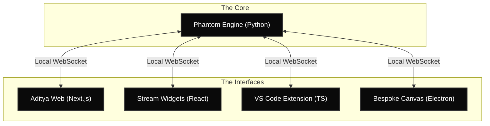

<div align="center">
  
</div>

<h1 align="center">ADITYA</h1>
<h3 align="center">The Sentient Operating System</h3>

<div align="center">

[](https://github.com/ThisisDarkNova/Aditya-Ai/actions)
[](https://opensource.org/licenses/MIT)
[]()

</div>

---

**Aditya** is not an assistant. It is a Rolls-Royce tier extension of your central nervous system. Built as a massively parallel Monorepo, Aditya hooks directly into your local hardware, your VS Code environment, and your OBS Live Stream, orchestrating your digital life entirely in the background.

## 🌌 The Omni-Presence Architecture

Aditya operates across 5 distinct pillars, communicating via local WebSockets to ensure **absolute data privacy** (zero cloud telemetry).



## 💎 Core Capabilities

- **Code Telepathy (Ghost Writer):** A custom VS Code extension that predicts optimal code structures and injects them physically into your editor.
- **The Chauffeur:** A Python daemon hooked into OBS WebSockets that automatically swaps your streaming scenes when you go AFK or die in-game.
- **Phantom Mode:** Aditya instantly detects unauthorized screen captures (Discord, OBS) and drops its UI opacity to 0% to protect your data.
- **Thermal Guardian:** Hard-wired motherboard sensors monitor CPU junction temperatures, forcefully suspending AI background tasks if temps exceed 85°C.

## 🚀 Installation & Build

Aditya is designed to be compiled locally. We provide a master PowerShell script that sequentially builds all 5 pillars.

1. Clone the repository:
   ```bash
   git clone https://github.com/ThisisDarkNova/Aditya-Ai.git
   cd Aditya-Ai
   ```
2. Execute the Master Build Script:
   ```powershell
   .\build_ascended.ps1
   ```
3. Retrieve your compiled binaries from the `Release/` directory.

## 🤝 Contributing & Security

We maintain strict standards for the Aditya ecosystem.
- Read our [Contributing Guide](CONTRIBUTING.md) before submitting Pull Requests.
- For vulnerability reports (e.g., WebSocket escapes), please refer to our [Security Policy](SECURITY.md).

<div align="center">
  <br/>
  <i>Engineered by DarkNova.</i>
</div>